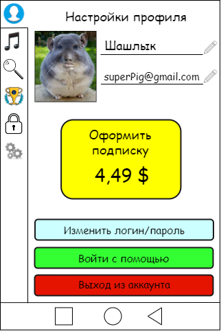

# Требования к проекту
---

# Содержание
1 [Введение](#intro)  
1.1 [Назначение](#appointment)  
1.2 [Бизнес-требования](#business_requirements)  
1.2.1 [Исходные данные](#initial_data)  
1.2.2 [Возможности бизнеса](#business_opportunities)  
1.2.3 [Границы проекта](#project_boundary)  
1.3 [Аналоги](#analogues)  
2 [Требования пользователя](#user_requirements)  
2.1 [Программные интерфейсы](#software_interfaces)  
2.2 [Интерфейс пользователя](#user_interface)  
2.3 [Характеристики пользователей](#user_specifications)  
2.3.1 [Классы пользователей](#user_classes)  
2.3.2 [Аудитория приложения](#application_audience)  
2.3.2.1 [Целевая аудитория](#target_audience)  
2.3.2.1 [Побочная аудитория](#collateral_audience)  
2.4 [Предположения и зависимости](#assumptions_and_dependencies)  
3 [Системные требования](#system_requirements)  
3.1 [Функциональные требования](#functional_requirements)  
3.1.1 [Основные функции](#main_functions)  
3.1.1.1 [Вход пользователя в приложение](#user_logon_to_the_application)  
3.1.1.2 [Настройка профиля активного пользователя](#setting_up_the_profile_of_the_active_user)  
3.1.1.3 [Загрузка новостей](#download_news)  
3.1.1.4 [Просмотр информации об отдельной новости](#view_information_about_an_individual_newsletter)  
3.1.1.5 [Выход пользователя из учётной записи](#active_user_change)  
3.1.1.6 [Регистрация нового пользователя после входа в приложение](#add_new_user)  
3.1.2 [Ограничения и исключения](#restrictions_and_exclusions)  
3.2 [Нефункциональные требования](#non-functional_requirements)  
3.2.1 [Атрибуты качества](#quality_attributes)  
3.2.1.1 [Требования к удобству использования](#requirements_for_ease_of_use)  
3.2.1.2 [Требования к безопасности](#security_requirements)  
3.2.2 [Внешние интерфейсы](#external_interfaces)  
3.2.3 [Ограничения](#restrictions)  

<a name="intro"/>

# 1 Введение

<a name="appointment"/>

## 1.1 Назначение

В этом документе описаны функциональные и нефункциональные требования к приложению «MusicBox» для Android. Проект представляет собой аналог популярных музыкальных сервисов. 

<a name="business_requirements"/>

## 1.2 Бизнес-требования

<a name="initial_data"/>

### 1.2.1 Исходные данные
Тяжело представить современный мир без музыки. Музыка является одной из самых популярных категорий и тем в Интернете, так как миллионы людей по всему миру ежедневно проводят свое время, слушая свои любимые композиции. В связи с популярностью музыки, данное приложение будет иметь огромную аудиторию и популярность, которая не пропадет со временем.

<a name="business_opportunities"/>

### 1.2.2 Возможности бизнеса
Огромное количество людей практически любой возрастной категории желают иметь приложение, которое позволит прослушивать музыку, обладая минимальой технической грамотностью. Подобное приложение позволит им тратить меньше времени на поиск и скачивание музыкальных произведений из Интернета. Интерфейс, будет спроектированн минималистично, т.к. сейчас минимализм стал одной из самых распространенных тенденций в веб-дизайне и дизайне мобильных приложений. Простота эквивалентна удобству. Данное приложение является очень удобным и интуитивно понятным в управлении, что зачастую приветсвуется пользователями.

<a name="project_boundary"/>

### 1.2.3 Границы проекта
Проект будет иметь два режима работы: Online и Offline. При использовании приложения в режиме Offline, пользователю будут доступны для прослушивания ранее загруженные музыкальные произведения. В режиме Online будет доступен более широкий спектр вохможностей, таких как: прослушивание произведений из списка популярных (за день/месяц/год), поиск композиций для прослушивания и скачивания. 

<a name="analogues"/>

## 1.3 Аналоги
Spotify (рус. Спотифа?й) — стриминговый сервис, позволяющий прослушивать музыкальные композиции, аудиокниги и подкасты, не скачивая их на устройство. Доступен в виде веб-сайта, приложений для всех операционных систем, смартфонов, смарт-устройств и медиа-систем автомобилей. На сервис приходится более 36 % мирового аудиостриминга, он доступен в большинстве стран мира.
Яндекс.Музыка. Один из крупнейших музыкальных сервисов страны обладает очень качественной фонотекой российских исполнителей, предлагает музыкальные плейлисты по настроению и автоматически создает автоподборку на основе личной коллекции пользователя после того, как песни в плейлисте закончились.

### 1.3.1 Отличия от аналогов.
В связи с практически монопольным влиянием аналогов, превзойти их не представляется возможным, кроме как реализации более быстрого доступа к базе данных за счет продуманных sql-запросов, а также минимазации потребляемого трафика и более низких системных требований. 

<a name="user_requirements"/>

# 2 Требования пользователя

<a name="software_interfaces"/>

## 2.1 Программные интерфейсы
Продукт должен являться мобильным приложением и иметь простое и приятное оформление. Оно должно подключаться к сервису MusicBoxApp.dev для поиска произведений из базы данных. Для написания приложения под Android версию использовать Kotlin, версию под IOS - Swift, для написания веб-сериса конкретных требований не выдвигается. 

<a name="user_interface"/>

## 2.2 Интерфейс пользователя
Окно просмотра и редактирования профиля.  
  

Основное окно.  

Окно поиска.  

Окно лучших произведений.  

Окно подписки.

Окно настроек.

<a name="user_specifications"/>

## 2.3 Характеристики пользователей

<a name="user_classes"/>

### 2.3.1 Классы пользователей

Пользователи делятся на три основные группы:
1. Обычные пользователи. Имеют доступ к базовым функциям приложения, таким как: прослушивание, поиск, скачивание музыки и т.д.
2. Авторизованные пользователи. Получают досуп к синхронизации аккаунта с другими устройствами.Также у них имеется возможность редактирования профиля, включая имя, почту, аватар.
3. Авторизованные пользователи с подпиской. При наличии подписки у пользователей появляются дополнительные возможности, такие как: просмотр статистики, поиск музыки по звуку и т.д.

<a name="application_audience"/>

### 2.3.2 Аудитория приложения

<a name="target_audience"/>

#### 2.3.2.1 Целевая аудитория
Люди любой возрастной категории, начиная с школьного возраста, обладающие самой минимальной технической грамотностью.

<a name="assumptions_and_dependencies"/>

## 2.4 Предположения и зависимости
1. Поиск, установка и прослушивание новых произведений не работает при отсутствии подключения к Интернету;
2. Веб-сервис должен иметь большую пропускную способность;
3. На сервисе ожидается большое количество пользователей.

<a name="system_requirements"/>

# 3 Системные требования

<a name="functional_requirements"/>

## 3.1 Функциональные требования

<a name="main_functions"/>

### 3.1.1 Основные функции

#### 3.1.1.1 Вход пользователя в приложение
**Описание.** Пользователь имеет возможность использовать приложение без создания собственного профиля либо войдя в свою учётную запись.

| Функция | Требования | 
|:---|:---|
| Вход в приложение без создания собственного профиля | Приложение должно предоставить пользователю возможность войти в приложение анонимно |
| <a name="registration_requirements"/>Регистрация нового пользователя | Приложение должно запросить у пользователя ввести имя для создания учётной записи. Пользователь должен либо ввести имя, либо отменить действие |
| *Пользователь с таким именем существует* | *Приложение должно известить пользователя об ошибке регистрации и запросить ввод псевдонима. Пользователь должен либо ввести псевдоним, либо отменить действие* |
| Вход зарегистрированного пользователя в приложение | Приложение должно предоставить пользователю список имён (псевдонимов) зарегестрированных пользователей. Пользователь должен либо выбрать из списка своё имя (псевдоним), либо отменить действие |

<a name="setting_up_the_profile_of_the_active_user"/>

#### 3.1.1.2 Настройка профиля активного пользователя
**Описание.** Зарегистрированный пользователь имеет возможность редактировать список ссылок на интернет-ресурсы, с которых производится выборка новостей, и списки (включений и исключений) ключевых фраз для фильтрации новостей.
 
| Функция | Требования | 
|:---|:---|
| Добавление интернет-ресурсов | Приложение должно предоставить зарегистрированному пользователю поле для ввода адреса RSS-ленты интернет-ресурса. Пользователь должен либо ввести адрес и подвердить действие, либо отменить его |
| Удаление интернет-ресурсов | Зарегистрированный пользователь имеет возможножность выделить адрес RSS-ленты в списке интернет-ресурсов и удалить его |
| Добавление ключевых фраз | Приложение должно предоставить зарегистрированному пользователю возможность выбрать список, в который будет добавлена фраза, и поле для её ввода. После выбора списка пользователь должен либо ввести фразу и подвердить действие, либо отменить его |
| Удаление ключевых фраз | Зарегистрированный пользователь имеет возможность выделить ключевую фразу в любом из списков и удалить её |

<a name="download_news"/>

#### 3.1.1.3 Загрузка новостей
**Описание.** После входа пользователя в приложение или после завершения радактирования профиля зарегистрированным пользователем необходимо загрузить информацию о новостях и отфильтровать их согласно спискам ключевых фраз.

| Функция | Требования | 
|:---|:---|
| Загрузка информации о новостях | Приложение должно загрузить информацию о новостях с интернет-ресурсов после входа пользователя в приложение или после завершения радактирования профиля зарегистрированным пользователем |
| Фильтрация новостей | Приложение должно отфильтровать новости согласно спискам ключевых фраз |

<a name="view_information_about_an_individual_newsletter"/>

#### 3.1.1.4 Просмотр информации об отдельной новости
**Описание.** Пользователь имеет возможность просмотреть информацию о каждой новости, представленной в таблице.

| Функция | Требования | 
|:---|:---|
| Просмотр краткой информации | Пользователь имеет возможность выбрать новость в таблице одинарным кликом по ней. Приложение должно отобразить её заголовок, описание и дату размещения "Подробнее" главного окна приложения |
| Просмотр подробной информации | Пользователь имеет возможность выбрать новость в таблице двойным кликом по ней. Приложение должно открыть полную версию страницы в браузере, установленном в системе по умолчанию |

<a name="active_user_change"/>

#### 3.1.1.5 Выход зарегистрированного пользователя из учётной записи
**Описание.** Зарегистрированный пользователь имеет возможность выйти из учётной записи.

**Требование.** Приложение должно предоставить зарегистрированному пользователю возможность выйти из учётной записи с возвратом к окну входа в приложение.

<a name="add_new_user"/>

#### 3.1.1.6 Регистрация нового пользователя после входа в приложение
**Описание.** Анонимный пользователь имеет возможность зарегистрироваться в приложении.

**Требование.** Приложение должно предоставить анонимному пользователю возможность [зарегистрироваться в приложении](#registration_requirements). 

<a name="restrictions_and_exclusions"/>

### 3.1.2 Ограничения и исключения
1. Прослушивание, поису, установка новых произвдений и радактирование профиля работает только при наличии подключения к Интернету;

<a name="non-functional_requirements"/>

## 3.2 Нефункциональные требования

<a name="quality_attributes"/>

### 3.2.1 Атрибуты качества

<a name="requirements_for_ease_of_use"/>

#### 3.2.1.1 Требования к удобству использования
1. Доступ к основным функциям приложения не более чем за две операции;
2. Все назначчения функциональных элементов пользовательского интерфейса должны быть интуитивно понятны;
3. Обновление информации на сервисе происходит каждый час.

<a name="security_requirements"/>

#### 3.2.1.2 Требования к безопасности
.

<a name="external_interfaces"/>

### 3.2.2 Внешние интерфейсы
Окна приложения удобны для использования пользователями с плохим зрением:
  * размер шрифта не менее 12-14пт;
  * интерфейс минималистичен и прост в освоении.

<a name="restrictions"/>

### 3.2.3 Ограничения
1. Android версия приложение реализована при помощи Kotlin, для построения пользовательского интерфейса - Jetpack Compose, для реализации многопоточности - coroutine;
2. IOS версия приложение реализована при помощи Swift, для построения пользовательского интерфейса - UIkit, в связи с нестабильностью работы SwiftUI, для реализации многопоточности - GCD;
4. В качестве базы данных использовать SQLite.

Проект должен предоставлять возможности для:
1. Регистрации/авторизация пользователей, для доступа к аккаунту с разных устройств.
2. Возможности авторизации с помощью аккаунта Google/Вконтакте/Facebook и т.д.
3. Прослушивание музыкальных произведений, ранее загруженных на устройство, без подключения к интернету.
4. Создание собственных плейлистов.
5. Наличие широкой базы данных произвдений, с функционалом ее постоянного обновления.
6. Возможность просмотра списка произведений, с разделением по авторам/исполнителям/жанрам.
7. Возможность преобретения подписки, для формирования списка предпочтений, на основе анализа прослушиваемых композиций, а также просмотра статистики и отключения рекламы. 
8. Наличие функции поиска произведения по звуку, при наличии подписки, а также возможность работы данной функции в фоновом режиме. 
9. Формирование списка предпочтений на основе прослушивания авторов.
10. Формирование списка предпочтений на основе прослушивания исполнителей.
11. Формирование списка предпочтений на основе прослушивания жанров.
12. Формирование списка предпочтений сразу на основе авторов, исполнителей и жанров.
13. Возможность сбора статистики о времени затрачиваемом на прослушивание музыки за день/месяц/год, наиболее популярный автор/исполнитель/жанр.
14. Наличие настроек, таких как: выбор места расположения для скачивания произведений, наличие функции родительского контроля/детского фильтра, переход на светлую/темную тему.